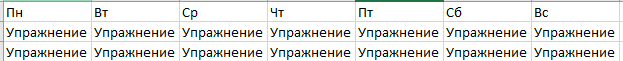

### Бот для фитнес-трекинга

Бот поддерживает следующие команды:

```
/create_train - Создать тренировку
/edit_train - Редактирование тренировки
/import_train - Импорт тренировки из файла форматов XLSX/CSV
/get_trains - Вывод списка тренировок
/standart - Получить список стандартных тренировок
/help - Справочная информация о командах
```

Пользователи хранятся в базе данных SQL в формате: id INTEGER, train TEXT.
При запуске бота пользователь автоматически добавляется в БД.

Команда ```/edit_train``` поддерживает две операции над тренировками: удаление и изменение. Изменение тренировки предполагает полное изменение всей тренировки.

Команда ```/import_train``` требует определенного формата входного файла. Файл должен содержать тренировки по дням недели.

<p align="center">
  
</p>

Перед тем, как создавать докер контейнер, необходимо вставить токен для бота в файле /src/utils/constants.py
```python
APY_KEY = "YOUR_TOKEN"
```

После этого следует запустить Docker Engine и выполнить команды:
```cmd
docker build -t takayama_sport_tracker .
docker run -d -p 80:80 takayama_sport_tracker
```


